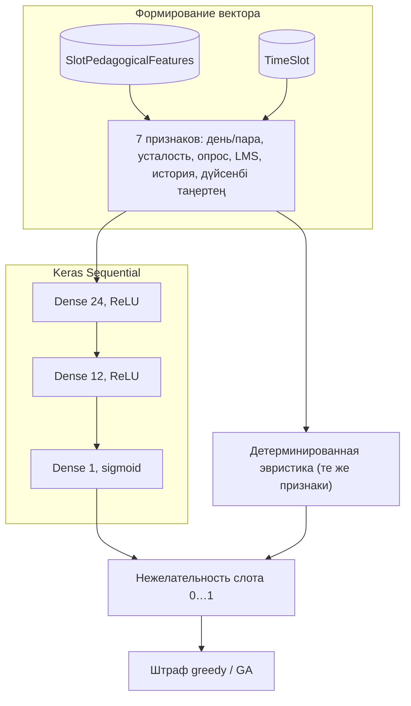

# МАТИКА — автоматизация учебного расписания (Django)

[](https://github.com/Remo000000/MATIKA_PROTOTYPE/actions/workflows/ci.yml)

Веб-приложение для вуза с **изоляцией данных по организациям** (`Organization`): в одной базе можно вести несколько независимых «тенантов» (факультеты, аудитории, слоты, пользователи). Это **модель тенанта в БД** и настройки по умолчанию (`DEFAULT_ORGANIZATION_SLUG`), а не отдельные поддомены SaaS.

Подходит для демо, курсовой/дипломной работы и пилота; перед промышленным запуском — отдельный аудит безопасности, почты и инфраструктуры.

**Публичного «живого» демо по постоянному URL в репозитории нет:** развёртывание — локально (`runserver`) или по инструкциям для Render/Heroku внизу README.

## Тақырыпқа сәйкестік (қысқаша)

**Тақырып:** нейрондық желілермен деректерді талдау негізінде сабақтардың оңтайлы уақыт аралықтарын болжай отырып, оқу жоспарлары мен кестелерді басқаруға арналған веб-жүйе.

**Қысқаша:** әр уақыт ұяшығы үшін шаршау, сауалнама, LMS, өткен семестр деректері жинақталады. Оқытылған **TensorFlow/Keras** моделі бар кезде слоттың **ыңғайсыздық** индексін (0…1) болжайды; модель салмақтарының файлы жоқ немесе TensorFlow орнатылмаған болса, сол белгілер бойынша **эвристикалық әдіс** қолданылады — яғни кесте құрастыру **әр сәтте толық нейрожелі емес**, резервтік жол әрқашан дайын. Бұл индекс **кесте генераторының** жұмсақ штрафтарына кіреді (greedy + генетикалық алгоритм, оның **fitness** функциясы). Толық талдау: әкімші мәзіріндегі **«Слоттардың нейрожелі талдауы»** бөлімі (`scheduling` қолданбасындағы `slot-prediction` маршруты).

## Стек

| Компонент | Описание |
|-----------|----------|
| Python / Django | `Django 5.2`, кастомная модель пользователя `accounts.User` |
| БД | По умолчанию **SQLite** (`db.sqlite3`); продакшен — **PostgreSQL** через `DATABASE_URL` |
| Статика | **WhiteNoise**, фронт: Bootstrap, Bootstrap Icons, Chart.js в `static/vendor/` |
| ML (расписание) | **TensorFlow / Keras**, подприложение `scheduling.ml` — см. [архитектуру сети](#архитектура-нейронной-сети) и [признаки слотов](#нейросеть-и-признаки-слотов) |
| i18n | Интерфейс: **Русский / Қазақша / English** (`locale/`) |

## Возможности

### Учётные записи и роли

- Роли: **администратор / преподаватель / студент** (пользователь привязан к организации).
- Регистрация: студент выбирает **группу**, преподаватель — **кафедру**; пароли с валидаторами Django.
- Сброс пароля по email (нужен SMTP в `.env`).
- Профиль, уведомления (в т.ч. по согласованию заявок преподавателей на изменение предпочтений по расписанию).

### Справочники и расписание

- Управление **факультетами, кафедрами, группами, аудиториями, дисциплинами, слотами времени** в рамках организации администратора.
- **Учебные периоды** (семестры): версии недельного расписания привязаны к периоду.
- **Потребности в парах** (`TeachingRequirement`) → генерация занятий (`Lesson`).

### Алгоритмы составления расписания

1. **Жадная расстановка** по «трудности» требований (узкий выбор аудиторий / предпочтения преподавателя).
2. **Локальная оптимизация** (hill climbing): переносы и обмены слотами для смягчения мягких штрафов.
3. **Генетический алгоритм** — отдельная кнопка оптимизации существующего расписания.

Жёсткие ограничения: один преподаватель / группа / аудитория на слот, вместимость аудитории.  
Мягкие штрафы: окна в расписании группы, перегруз подряд идущими парами, предпочтения преподавателя по дням/парам, ранние/поздние пары, а также **оценка нежелательности слота** из ML/эвристики (см. ниже).

### Нейросеть и признаки слотов

- **`SlotPedagogicalFeatures`**: на слот — усталость, опрос, LMS, история; опционально метка для обучения.
- **`scheduling/ml/predict.py`** (shim `scheduling/ml_predict.py`): признаки (день, пара, четыре индикатора, **белгі «дүйсенбі таңертең»**) → **нежелательность слота** 0…1.
- Веса: **`MEDIA_ROOT/scheduling_ml/slot_unfitness.keras`**. Нет файла или TF — **эвристикалық әдіс / детерминированная эвристика** на тех же признаках (см. выше: это не «чистая» НН в каждом запуске).
- Штраф слота участвует в greedy, локальной оптимизации и **fitness генетического алгоритма** (не «фитнес GA» как отдельная сущность — это значение приспособленности в GA).

Команда обучения:

```bash
python manage.py train_slot_unfitness_model
# или явно: --organization-id 1 --epochs 120
```

**Интерфейс отчёта:** меню администратора — **«Нейросетевой анализ слотов»** (маршрут аналогичен пути `slot-prediction` в приложении `scheduling`): таблица, CSV, статус Keras или эвристики. На **«Генерации»** — краткий текст про ML и штрафы.

После **`seed_demo`** для демо заводятся строки признаков; **дүйсенбі таңертеңгі** слоттар үшін шаршау мен сауалнама көрсеткіштері әдейі жоғарырақ қойылады (демо көрсету үшін). В продакшене данные — из админки или своих источников.

### Архитектура нейронной сети

Обучение задаётся в `scheduling/management/commands/train_slot_unfitness_model.py`: последовательная сеть **7 → 24 (ReLU) → 12 (ReLU) → 1 (sigmoid)** на признаках слота; целевое значение — метка `target_unfitness_label` или эвристика на тех же признаках. Инференс и запасной путь (без весов) совпадают по размерности вектора.



Если TensorFlow недоступен или файл `slot_unfitness.keras` отсутствует, используется только **детерминированная эвристика** — тот же вектор признаков и формула без нейросетевых весов.

### Интерфейс и экспорт

- Личное расписание преподавателя/студента, группы; фильтры; **черновики** и публикация занятий (по логике приложения).
- **Экспорт Excel** и **календарь iCal** (`.ics`) — в разделе расписания.
- **Аналитика** (`/analytics/`): загрузка преподавателей и аудиторий, графики (Chart.js), экспорт **CSV**.
- **REST API** занятий: `GET /scheduling/api/lessons/` (сессионная аутентификация).
- Лог запусков алгоритмов в админке и на странице генерации (`AlgorithmRunLog`); в деталях генерации указывается `ml_slot_bias`: `keras` или `heuristic`.

## Структура репозитория (кратко)

```
matika/          # настройки проекта, urls
accounts/        # пользователи, профили, уведомления
university/      # организации, факультеты, группы, аудитории, слоты
scheduling/      # периоды, занятия, генерация, API
scheduling/ml/   # подприложение Django: прогноз нежелательности слота (Keras + эвристика)
dashboard/       # главная, аналитика
static/, templates/
locale/          # переводы ru / kk / en
tests/
scripts/         # вспомогательные скрипты (например compile_locale)
LICENSE          # MIT
CONTRIBUTING.md
.env.example
```

## Быстрый старт (локально)

### 1) Виртуальное окружение и зависимости

```bash
python -m venv .venv
# Windows:
.venv\Scripts\activate
pip install -r requirements.txt
```

`requirements.txt` включает **TensorFlow** (для обучения и инференса модели слотов). Установка может занять время и место на диске.

### 2) Переменные окружения

Скопируйте `.env.example` в `.env` и при необходимости отредактируйте. Для **сброса пароля и реальных писем** задайте `EMAIL_BACKEND` и параметры SMTP (комментарии в `.env.example`).

### 3) Миграции и демо-данные

```bash
python manage.py migrate
python manage.py seed_demo
```

**SQLite и блокировка:** перед `seed_demo`, `localize_demo_data` и любыми долгими командами, пишущими в БД, **остановите** `python manage.py runserver` (и другие процессы, держащие файл `db.sqlite3`). Иначе возможна ошибка `database is locked`.

При добавлении новых моделей (например `SlotPedagogicalFeatures`) **обязательно** выполняйте `migrate`, иначе появится ошибка вида `no such table: scheduling_slotpedagogicalfeatures`.

Опционально — обучить модель нежелательности слотов (нужен TensorFlow и строки в `SlotPedagogicalFeatures`, после `seed_demo` их достаточно):

```bash
python manage.py train_slot_unfitness_model
```

### 4) Запуск сервера

```bash
python manage.py runserver
```

Откройте `http://127.0.0.1:8000/`.

### Демо-доступы (после `seed_demo`)

Почты в формате казахских имён, домен `@gmail.com` (демо).

> **Важно:** пароли ниже только для локальной демонстрации. Перед любым развёртыванием в сети смените пароли и удалите или пересоздайте демо-данные.

- **admin:** `batima.tileikhan@gmail.com` / `admin12345`
- **teacher / student:** `имя.фамилия@gmail.com`, пароли `teacher12345` / `student12345`

Если в базе остались старые демо-почты (`@matika.local`):

```bash
python manage.py apply_kazakh_demo_identities
```

## GitHub

Официальный репозиторий: [github.com/Remo000000/MATIKA_PROTOTYPE](https://github.com/Remo000000/MATIKA_PROTOTYPE).

- **CI:** [Actions → CI](https://github.com/Remo000000/MATIKA_PROTOTYPE/actions/workflows/ci.yml) — `ruff`, проверки Django, `pytest` на каждый push/PR в `main`/`master`.
- **Обновления зависимостей:** настроен [Dependabot](https://github.com/Remo000000/MATIKA_PROTOTYPE/blob/main/.github/dependabot.yml) (еженедельно pip, ежемесячно GitHub Actions) — обновления приходят отдельными pull request’ами.

```bash
git clone https://github.com/Remo000000/MATIKA_PROTOTYPE.git
cd MATIKA_PROTOTYPE
git remote -v
```

После правок: `git add`, `git commit`, `git push origin main` (ветка по умолчанию — `main`). Убедитесь, что в коммит не попадают секреты (`.env`) и локальная БД `db.sqlite3` — они в `.gitignore`.

## База данных

- **SQLite** — по умолчанию, файл `db.sqlite3` в корне проекта. В `DEBUG` для сессий используются **подписанные cookie**, чтобы снизить блокировки БД на Windows.
- **PostgreSQL** — задайте `DATABASE_URL` в `.env` (см. `.env.example`).

## Локализация

```bash
python manage.py makemessages -l ru -l kk -l en
python manage.py compilemessages
```

В репозитории также есть `scripts/compile_locale.py` для удобной перекомпиляции сообщений.

## Тесты и качество кода

```bash
pip install -r requirements.txt -r requirements-dev.txt
pytest
ruff check .
```

В CI (GitHub Actions): `ruff`, `manage.py check`, `manage.py check --deploy`, `pytest`.

## Продакшен (краткий чеклист)

- `DEBUG=0`, длинный случайный `SECRET_KEY`.
- `ALLOWED_HOSTS`, `CSRF_TRUSTED_ORIGINS`, почта, при необходимости **Sites** в админке для ссылок в письмах.
- `python manage.py collectstatic`, reverse-proxy + HTTPS.
- `python manage.py check --deploy`.

## Развёртывание в облаке (бесплатный тариф, скриншоты для диплома)

Ниже — типовой путь для **Render** и **Heroku** (оба предлагают бесплатные или trial-тарифы; условия меняются — проверьте актуальные лимиты на сайте провайдера).

### Render.com

1. Создайте **PostgreSQL** (Free или Starter) в дашборде Render.
2. Создайте **Web Service** с этим репозиторием: **Build command**:  
   `pip install -r requirements.txt && python manage.py collectstatic --noinput`  
   **Start command**:  
   `gunicorn matika.wsgi:application --bind 0.0.0.0:$PORT`
3. В **Environment** задайте как минимум: `DATABASE_URL` (из панели PostgreSQL), `SECRET_KEY`, `DEBUG=0`, `ALLOWED_HOSTS` (ваш домен `*.onrender.com` или свой), `CSRF_TRUSTED_ORIGINS=https://ваш-сервис.onrender.com`, при необходимости `DEFAULT_ORGANIZATION_SLUG` / `DEFAULT_ORGANIZATION_NAME`.
4. После первого деплоя в **Shell** выполните `python manage.py migrate` (или добавьте release command в настройках сервиса).
5. Сделайте скриншоты: переменные окружения (без секрета), успешный деплой, страница входа в браузере.

### Heroku

1. Установите [Heroku CLI](https://devcenter.heroku.com/articles/heroku-cli), войдите в аккаунт.
2. `heroku create your-app-name`, затем `heroku addons:create heroku-postgresql:mini` (или актуальный бесплатный/mini-план).
3. Репозиторий уже содержит `Procfile` и `runtime.txt`. Задайте конфиг:  
   `heroku config:set DEBUG=0 SECRET_KEY=... ALLOWED_HOSTS=.herokuapp.com CSRF_TRUSTED_ORIGINS=https://your-app-name.herokuapp.com`
4. `git push heroku main` — после сборки выполните `heroku run python manage.py migrate`.
5. Скриншоты: вкладка **Resources** / **Settings**, лог `heroku logs --tail`, работающий сайт.

В обоих случаях статика отдаётся через **WhiteNoise**; для загрузки пользовательских файлов в `MEDIA` может понадобиться внешнее хранилище (S3-совместимое и т.д.) — для учебного демо часто достаточно БД и статики.

## Лицензия

Проект распространяется под лицензией **MIT** (файл `LICENSE`). Участие описано в `CONTRIBUTING.md`.
