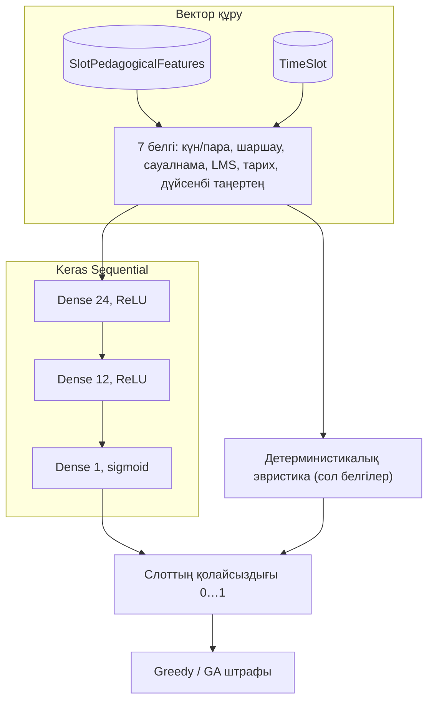

# МАТИКА — оқу кестесін автоматтандыру (Django)

[](https://github.com/Remo000000/MATIKA_PROTOTYPE/actions/workflows/ci.yml)

Бұл — жоғары оқу орны үшін арналған веб-қосымша. **Деректер ұйым бойынша бөлінеді** (`Organization`): бір дерекқорда бірнеше тәуелсіз «тенант» жұмыс істей алады — факультеттер, аудиториялар, уақыт ұяшықтары, пайдаланушылар. Бұл SaaS-тай әртүрлі поддомен емес, **дерекқордағы тенант моделі** және әдепкі баптаулар (`DEFAULT_ORGANIZATION_SLUG`).

Демо, курстық жұмыс немесе пилот үшін қолайлы. Өндіріске шығармас бұрын қауіпсіздік, пошта және инфрақұрылым бойынша жеке тексеруді жоспарлаған жөн.

**Жария демоға тұрақты URL жоқ** — орнату локальды (`runserver`) немесе төмендегі Render/Heroku нұсқаулықтары бойынша.

## Тақырыпқа не сәйкес келеді

**Тақырып:** нейрондық желілер арқылы деректерді талдау негізінде сабақтардың оңтайлы уақыт аралықтарын болжай отырып, оқу жоспарлары мен кестелерді басқаруға арналған веб-жүйе.

**Қысқаша:** әр уақыт ұяшығы үшін шаршау, сауалнама, LMS, өткен семестр деректері жинақталады. **TensorFlow/Keras** моделі оқытылған кезде слоттың **ыңғайсыздық** индексін (0…1) болжайды; салмақтар файлы жоқ немесе TensorFlow орнатылмаған болса, сол белгілер бойынша **эвристикалық әдіс** қосылады — яғни кесте әр жүргізуде таза нейрожеліге тәуелді емес, резерв жол әрқашан дайын. Бұл индекс **кесте генераторының** жұмсақ штрафтарына кіреді (greedy + генетикалық алгоритм, оның **fitness** функциясы). Толығырақ: әкімші мәзіріндегі **«Слоттардың нейрожелі талдауы»** (`scheduling` қолданбасындағы `slot-prediction` маршруты).

## Технологиялар

| Компонент | Сипаттама |
|-----------|-----------|
| Python / Django | `Django 5.2`, `accounts.User` кастом моделі |
| Дерекқор | Әдепкі — **SQLite** (`db.sqlite3`); өндіріс — **PostgreSQL** (`DATABASE_URL`) |
| Статика | **WhiteNoise**, интерфейс: Bootstrap, Bootstrap Icons, Chart.js (`static/vendor/`) |
| ML (кесте) | **TensorFlow / Keras**, `scheduling.ml` — төмендегі архитектура мен белгілер |
| i18n | **Орыс / Қазақ / Ағылшын** (`locale/`) |

## Не істей алады

### Аккаунттар мен рөлдер

- Рөлдер: **әкімші / оқытушы / студент** (пайдаланушы ұйымға байланысты).
- Тіркелу: студент **топты**, оқытушы **кафедраны** таңдайды; парольдер Django валидаторларымен тексеріледі.
- Пошта арқылы пароль қалпына келтіру (SMTP `.env`-те қажет).
- Профиль, хабарландырулар (соның ішінде оқытушының кесте бойынша талаптарын өзгерту өтінімдерін келісу).

### Анықтамалықтар және кесте

- Әкімші өз ұйымы шегінде **факультеттер, кафедралар, топтар, аудиториялар, пәндер, уақыт слоттары** басқарады.
- **Оқу кезеңдері** (семестрлер): апталық кесте нұсқалары кезеңге байланысты.
- **Сабақ қажеттіліктері** (`TeachingRequirement`) → занятиялар (`Lesson`) генерациясы.

### Кесте құрастыру алгоритмдері

1. **Шұғыл орналастыру** — талаптардың «қиындығына» қарай (тар аудитория таңдауы, оқытушының талғамы).
2. **Жергілікті оңтайландыру** (hill climbing): слоттарды ауыстыру және алмасу, жұмсақ штрафтарды жеңілдету үшін.
3. **Генетикалық алгоритм** — бар кестені оңтайландыру үшін бөлек батырма.

Қатты шектеулер: бір слотта бір оқытушы / топ / аудитория, аудитория сыйымдылығы.  
Жұмсақ штрафтар: топтың «терезелері», қатар келген сабақтардың жүктемесі, оқытушының күн/сағат бойынша талғамы, ерте/кеш сабақтар, сондай-ақ ML/эвристикадан **слоттың қолайсыздығы** (төменде).

### Нейрожелі және слот белгілері

- **`SlotPedagogicalFeatures`**: әр слотқа шаршау, сауалнама, LMS, тарих; оқыту үшін опционалды белгі.
- **`scheduling/ml/predict.py`** (`scheduling/ml_predict.py` shim): белгілер (күн, пара, төрт индикатор, **дүйсенбі таңертең**) → **слоттың қолайсыздығы** 0…1.
- Салмақтар: **`MEDIA_ROOT/scheduling_ml/slot_unfitness.keras`**. Файл жоқ немесе TF жоқ — сол белгілер бойынша **эвристика** (әр жүргізуде таза НН емес).
- Слот штрафы greedy, жергілікті оңтайландыруда және **GA fitness**-те қатысады.

Модельді оқыту:

```bash
python manage.py train_slot_unfitness_model
# немесе: --organization-id 1 --epochs 120
```

**Есеп интерфейсі:** әкімші мәзірі — **«Слоттардың нейрожелі талдауы»** (`slot-prediction`): кесте, CSV, Keras немесе эвристика күйі. **«Генерация»** бетінде ML және штрафтарға қысқаша мәтін.

**`seed_demo`** кейін демода белгі жолдары пайда болады; **дүйсенбі таңертеңгі** слоттар үшін шаршау мен сауалнама әдейі жоғарырақ (демо көрсету үшін). Өндірісте деректер әкімшіліктен немесе өз көздеріңізден.

### Нейрожелі архитектурасы

Оқыту `scheduling/management/commands/train_slot_unfitness_model.py` арқылы: **7 → 24 (ReLU) → 12 (ReLU) → 1 (sigmoid)** тізбекті желі; мақсат — `target_unfitness_label` немесе сол белгілердегі эвристика. Инференс пен резерв жол (салмақсыз) вектор өлшемі бойынша сәйкес келеді.



TensorFlow жоқ немесе `slot_unfitness.keras` жоқ болса, тек **детерминистикалық эвристика** қолданылады — сол вектор және нейрожелісіз формула.

### Интерфейс және экспорт

- Оқытушы/студенттің жеке кестесі, топ кестесі; сүзгілер; **ұсақ нұсқалар** және сабақтарды жариялау (қосымша логикасына сәйкес).
- **Excel экспорты** және **iCal** (`.ics`).
- **Аналитика** (`/analytics/`): оқытушылар мен аудиториялардың жүктемесі, графиктер (Chart.js), **CSV** экспорты.
- **REST API** сабақтар: `GET /scheduling/api/lessons/` (сессиялық аутентификация).
- Алгоритм жүргізулерінің журналы әкімшілікте және генерация бетінде; детальда `ml_slot_bias`: `keras` немесе `heuristic`.

## Репозиторий құрылымы

```
matika/          # жоба баптаулары, urls
accounts/        # пайдаланушылар, профиль, хабарландырулар
university/      # ұйымдар, факультеттер, топтар, аудиториялар, слоттар
scheduling/      # кезеңдер, сабақтар, генерация, API
scheduling/ml/   # слоттың қолайсыздығын болжау (Keras + эвристика)
dashboard/       # басты бет, аналитика
static/, templates/
locale/          # ru / kk / en аудармалары
tests/
scripts/         # көмекші скрипттер (мысалы compile_locale)
LICENSE          # MIT
CONTRIBUTING.md
.env.example
```

## Жерде жылдам іске қосу

### 1) Виртуалды орта және тәуелділіктер

```bash
python -m venv .venv
# Windows:
.venv\Scripts\activate
pip install -r requirements.txt
```

`requirements.txt` ішінде **TensorFlow** бар (модель оқыту және инференс). Орнату уақыт алады және диск орнын көп алуы мүмкін.

### 2) Орта айнымалылары

`.env.example` файлын `.env` деп көшіріп, қажетін түзетіңіз. Пошта және пароль қалпына келтіру үшін `EMAIL_BACKEND` және SMTP (түсініктемелер `.env.example`-те).

### 3) Миграциялар және демо

```bash
python manage.py migrate
python manage.py seed_demo
```

**SQLite және блокировка:** `seed_demo`, `localize_demo_data` және дерекқорға ұзақ жазатын командалар алдында **`python manage.py runserver`** (және `db.sqlite3` ұстап тұрған басқа процестер) тоқтатылғаны жөн. Әйтпесе `database is locked` қатесі шығуы мүмкін.

Жаңа модель қосқанда (мысалы `SlotPedagogicalFeatures`) **`migrate`** міндетті, әйтпесе `no such table: scheduling_slotpedagogicalfeatures` тәрізді қате шығады.

Опционалды — слот моделін оқыту (TensorFlow және `SlotPedagogicalFeatures` жолдары қажет; `seed_demo` кейін жеткілікті):

```bash
python manage.py train_slot_unfitness_model
```

### 4) Сервер

```bash
python manage.py runserver
```

Шолғышта: `http://127.0.0.1:8000/`.

### Демо кірулер (`seed_demo` кейін)

Пошталар қазақ есімдері форматында, домен `@gmail.com` (демо).

> **Маңызды:** төмендегі парольдер тек жергілікті демо үшін. Желіде орналастырмас бұрын парольдерді өзгертіңіз немесе демо деректерін жойыңыз/қайта құрыңыз.

- **әкімші:** `batima.tileikhan@gmail.com` / `admin12345`
- **оқытушы / студент:** `аты.фамилиясы@gmail.com`, парольдер `teacher12345` / `student12345`

Егер базада ескі демо-пошталар қалған болса (`@matika.local`):

```bash
python manage.py apply_kazakh_demo_identities
```

## GitHub

Ресми репозиторий: [github.com/Remo000000/MATIKA_PROTOTYPE](https://github.com/Remo000000/MATIKA_PROTOTYPE).

- **CI:** [Actions → CI](https://github.com/Remo000000/MATIKA_PROTOTYPE/actions/workflows/ci.yml) — `main`/`master`-ға push/PR сайын `ruff`, Django тексерулері, `pytest`.
- **Тәуелділіктер:** [Dependabot](https://github.com/Remo000000/MATIKA_PROTOTYPE/blob/main/.github/dependabot.yml) (аптасына pip, айына GitHub Actions) — жаңартулар жеке pull request ретінде келеді.

```bash
git clone https://github.com/Remo000000/MATIKA_PROTOTYPE.git
cd MATIKA_PROTOTYPE
git remote -v
```

Өзгерістерден кейін: `git add`, `git commit`, `git push origin main` (әдепкі бұтақ — `main`). Коммитке `.env` сырлары мен жергілікті `db.sqlite3` кірмегеніне көз жеткізіңіз (олар `.gitignore`-та).

## Дерекқор

- **SQLite** — әдепкі, `db.sqlite3` жоба түбінде. `DEBUG` режимінде сессиялар үшін **қол қойылған cookie** қолданылады (Windows-та дерекқор блокировкасын азайту үшін).
- **PostgreSQL** — `.env`-те `DATABASE_URL` (`.env.example` қараңыз).

## Локализация

```bash
python manage.py makemessages -l ru -l kk -l en
python manage.py compilemessages
```

Репозиторийде хабарламаларды қайта компиляциялауға `scripts/compile_locale.py` бар.

## Тесттер және код сапасы

```bash
pip install -r requirements.txt -r requirements-dev.txt
pytest
ruff check .
```

CI (GitHub Actions): `ruff`, `manage.py check`, `manage.py check --deploy`, `pytest`.

## Өндіріс (қысқа чеклист)

- `DEBUG=0`, ұзын кездейсоқ `SECRET_KEY`.
- `ALLOWED_HOSTS`, `CSRF_TRUSTED_ORIGINS`, пошта; қажет болса әкімшіліктегі **Sites** (хаттардағы сілтемелер үшін).
- `python manage.py collectstatic`, reverse-proxy + HTTPS.
- `python manage.py check --deploy`.
